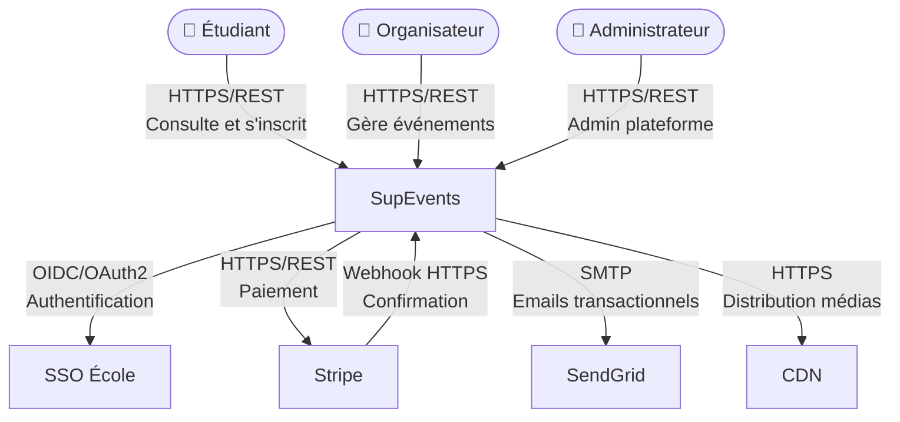
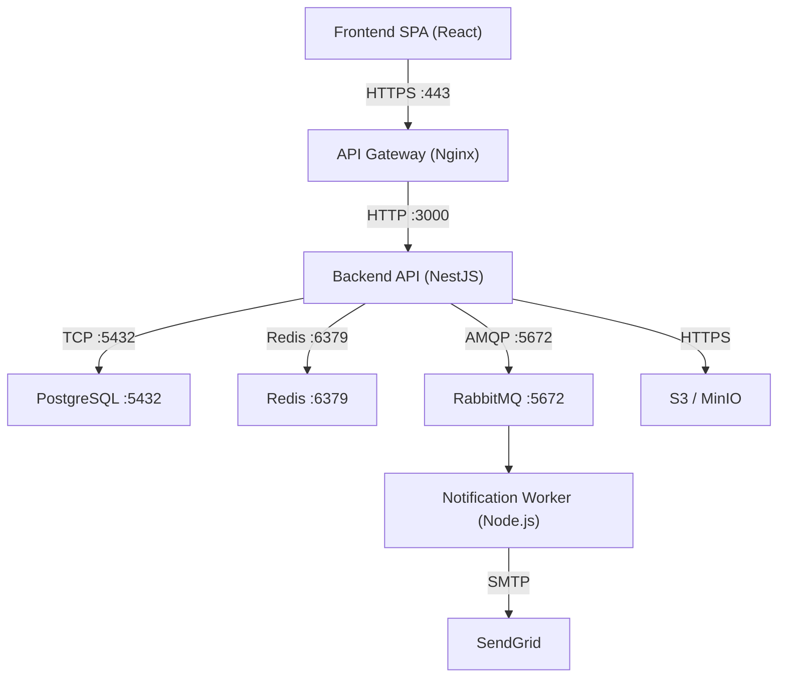

#### Diagramme C4 Context

Ce diagramme présente une vue globale du système SupEvents, en identifiant les acteurs principaux ainsi que les systèmes externes avec lesquels il interagit. Il permet de comprendre le périmètre du système et ses interactions sans entrer dans les détails techniques internes.

#### Diagramme C4 Containers

Ce diagramme détaille les principaux conteneurs applicatifs composant SupEvents. Il met en évidence les technologies utilisées ainsi que les interactions réseau entre les différents composants.

