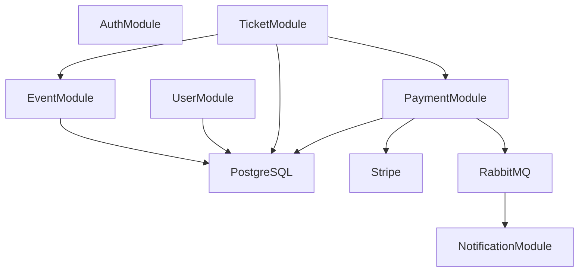
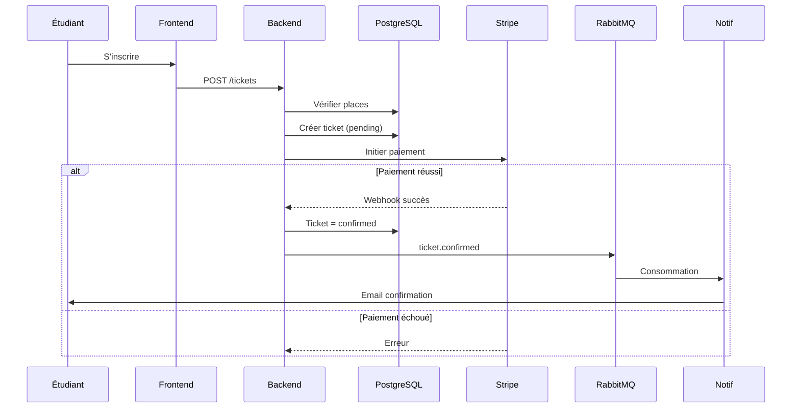
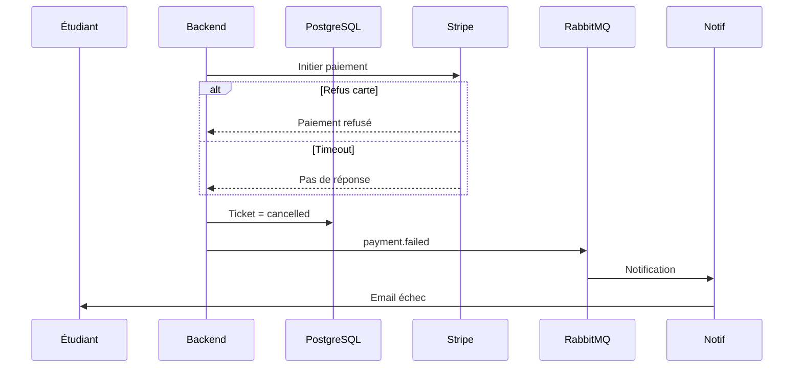

# §6.2 — Vue des processus

## Diagramme de composants — Backend

Ce diagramme présente l’organisation interne du backend SupEvents en modules fonctionnels.

#### Diagramme de séquence — Inscription à un événement

Ce diagramme représente le parcours nominal d’un utilisateur s’inscrivant à un événement, depuis la requête initiale jusqu’à la réception de la confirmation par email.

#### Diagramme de séquence — Échec de paiement

Ce diagramme décrit le comportement du système en cas d’échec de paiement lors de l’inscription à un événement.

