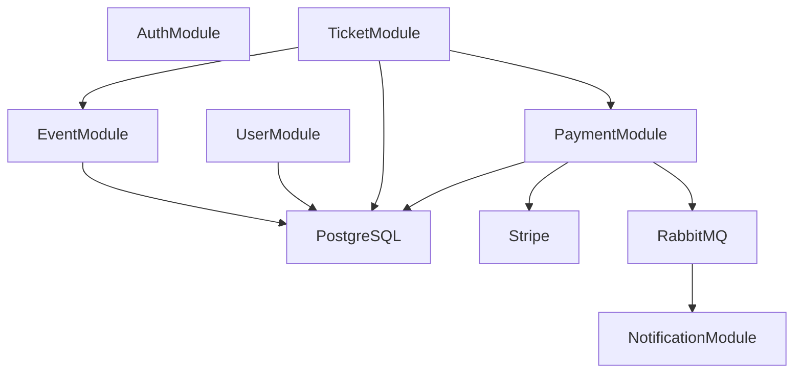

# §6.2 — Vue des processus

## Diagramme de composants — Backend

Ce diagramme présente l’organisation interne du backend SupEvents en modules fonctionnels.


```mermaid
flowchart TD

auth["AuthModule"]
user["UserModule"]
event["EventModule"]
ticket["TicketModule"]
payment["PaymentModule"]
notification["NotificationModule"]

event --> db["PostgreSQL"]
user --> db
ticket --> db
payment --> db

ticket --> event
ticket --> payment
payment --> stripe["Stripe"]

payment --> rabbit["RabbitMQ"]
rabbit --> notification
```

```

```
