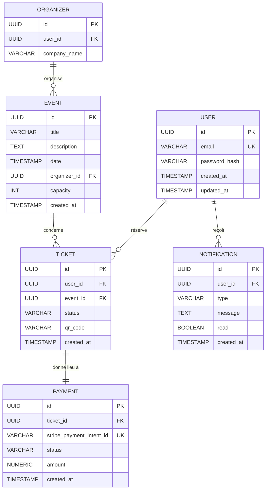

# §6.4 — Vue des données

## Modèle entité-relation

Ce modèle représente les données principales de SupEvents et leurs relations. Il sert de base à la conception de la base de données relationnelle.

