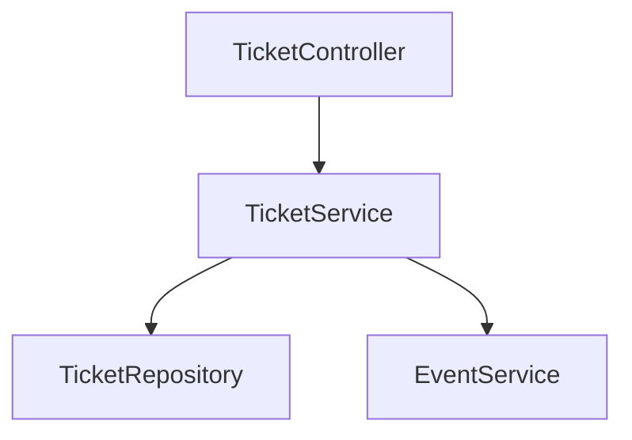
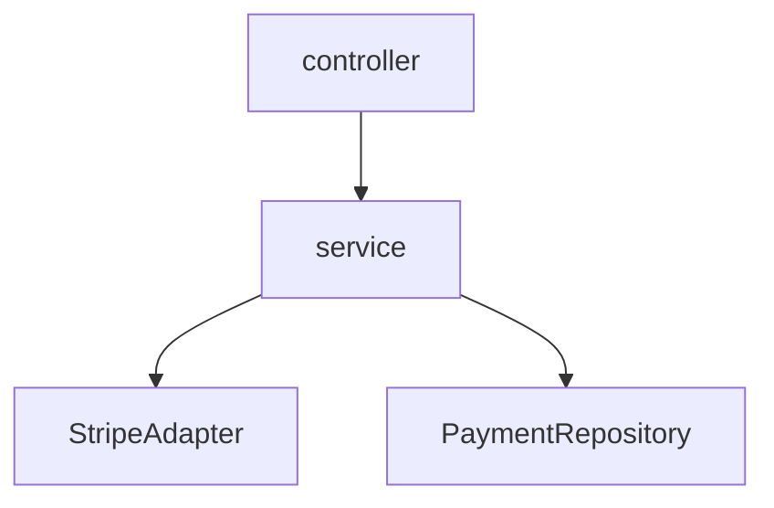
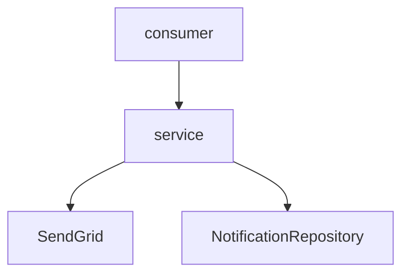

## §7.1 — TicketModule

### Responsabilité

Gérer l’inscription des utilisateurs aux événements avec contrôle de la jauge, gestion des états du ticket et prévention des conflits de réservation.

---

### Contrat d’interface

- Endpoints exposés :
  - POST /api/v1/tickets (201, 400, 409)
  - DELETE /api/v1/tickets/{id} (200, 404)

- Événements publiés :
  - ticket.confirmed → tickets.events.v1

- Événements consommés :
  - payment.failed → annulation du ticket

- Appels sortants :
  - Stripe (HTTPS) via PaymentModule

---

### Architecture interne

---

## §7.2 — PaymentModule

### Responsabilité

Gérer les paiements via Stripe, assurer l’idempotence et traiter les webhooks.

---

### Contrat d’interface

- Endpoints exposés :
  - POST /api/v1/payments/init (200, 400)
  - POST /api/v1/payments/webhook (200, 400)

- Événements publiés :
  - payment.failed → payments.events.v1

- Événements consommés :
  - ticket.created → init paiement

- Appels sortants :
  - Stripe API HTTPS

---

### Architecture interne

---

## §7.3 — NotificationModule

### Responsabilité

Envoyer des notifications (email et in-app) de manière asynchrone.

---

### Contrat d’interface

- Endpoints exposés : aucun

- Événements consommés :
  - ticket.confirmed
  - payment.failed

- Événements publiés : aucun

- Appels sortants :
  - SendGrid (SMTP)

---

### Architecture interne

