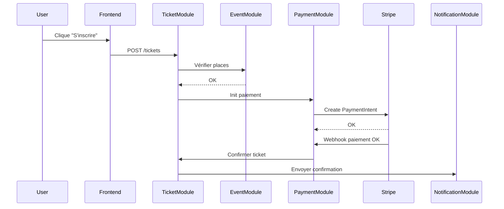
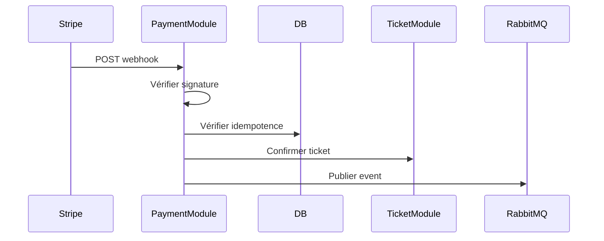

# §9 — Exigences transverses

### §9.1.1 — Flux inscription payante

Ce flux décrit l’inscription payante à un événement. L’utilisateur déclenche la création d’un ticket via le TicketModule, qui vérifie la disponibilité auprès de EventModule. Une fois validé, le PaymentModule initialise un paiement Stripe. Après validation côté Stripe, un webhook est reçu confirmant le paiement. Le TicketModule confirme alors le ticket et déclenche une notification. Les points critiques de sécurité incluent la gestion des paiements, la validation du webhook et la prévention des inscriptions concurrentes.

| Menace                     | Risque identifié                                 | Mesure de défense                    |
| -------------------------- | ------------------------------------------------ | ------------------------------------ |
| S — Spoofing               | Un utilisateur usurpe une identité pour réserver | Auth JWT + vérification côté backend |
| T — Tampering              | Modification du montant du paiement              | Montant recalculé côté serveur       |
| R — Repudiation            | Un utilisateur conteste son paiement             | Logs immuables + ID Stripe           |
| I — Information Disclosure | Fuite de données paiement                        | TLS + aucune donnée CB stockée       |
| D — DoS                    | Spam de réservation                              | Rate limiting + captcha              |
| E — Elevation              | Accès admin non autorisé                         | RBAC + vérification rôles            |

### §9.1.2 — Flux webhook Stripe

Ce flux traite la réception d’un webhook Stripe confirmant un paiement. Le PaymentModule vérifie la signature HMAC pour garantir l’authenticité. Il vérifie ensuite que l’événement n’a pas déjà été traité (idempotence). Si valide, il met à jour le paiement et notifie le TicketModule pour confirmation du ticket. Ce flux est critique car une mauvaise validation peut entraîner des fraudes ou des incohérences.

| Menace              | Risque identifié       | Mesure de défense                   |
| ------------------- | ---------------------- | ----------------------------------- |
| S — Spoofing        | Faux webhook Stripe    | Vérification signature HMAC         |
| T — Tampering       | Modification payload   | Signature Stripe                    |
| R — Repudiation     | Stripe nie envoi       | Logs + event.id                     |
| I — Info Disclosure | Fuite données paiement | TLS                                 |
| D — DoS             | Flood webhooks         | Rate limiting                       |
| E — Elevation       | Escalade via endpoint  | Endpoint isolé + validation stricte |

## §9.2 — Performance

| Objectif                | Solution technique                       | Composants                  | Vérification |
| ----------------------- | ---------------------------------------- | --------------------------- | ------------ |
| p95 < 500ms sur /events | Cache Redis + index DB + CDN             | EventModule                 | k6 en CI     |
| Disponibilité 99.5%     | Load balancer + autoscaling + monitoring | Tous modules                | Grafana      |
| 500 users simultanés    | Queue + scaling + DB pooling             | TicketModule, PaymentModule | Gatling      |

Disponibilité 99.5% → 0.5% indisponible

0.5% de 30 jours = 3.6 heures ≈ 3h36 min

➡️ Budget d’erreur mensuel : 3h36

## §9.3 — RGPD

| Donnée             | Finalité         | Base légale      | Durée  |
| ------------------ | ---------------- | ---------------- | ------ |
| Email              | Notification     | Contrat          | 3 ans  |
| Nom                | Identification   | Contrat          | 3 ans  |
| SSO ID             | Authentification | Intérêt légitime | 3 ans  |
| Historique tickets | Suivi            | Contrat          | 5 ans  |
| Stripe ID          | Paiement         | Oblig légale     | 10 ans |

- TLS pour toutes communications
- Chiffrement base de données
- Hash des tokens
- Gestion secrets via vault
- Séparation env dev/prod
- Rotation clés API
- Logs sécurisés

### Droit d’accès

Export JSON des données utilisateur sous 30 jours

### Droit à l’oubli

Suppression + anonymisation des factures

### Droit de rectification

Modification + sync Stripe
